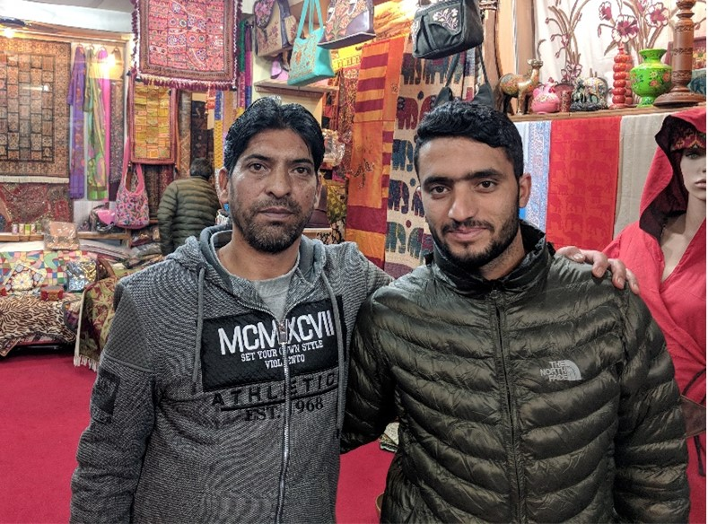
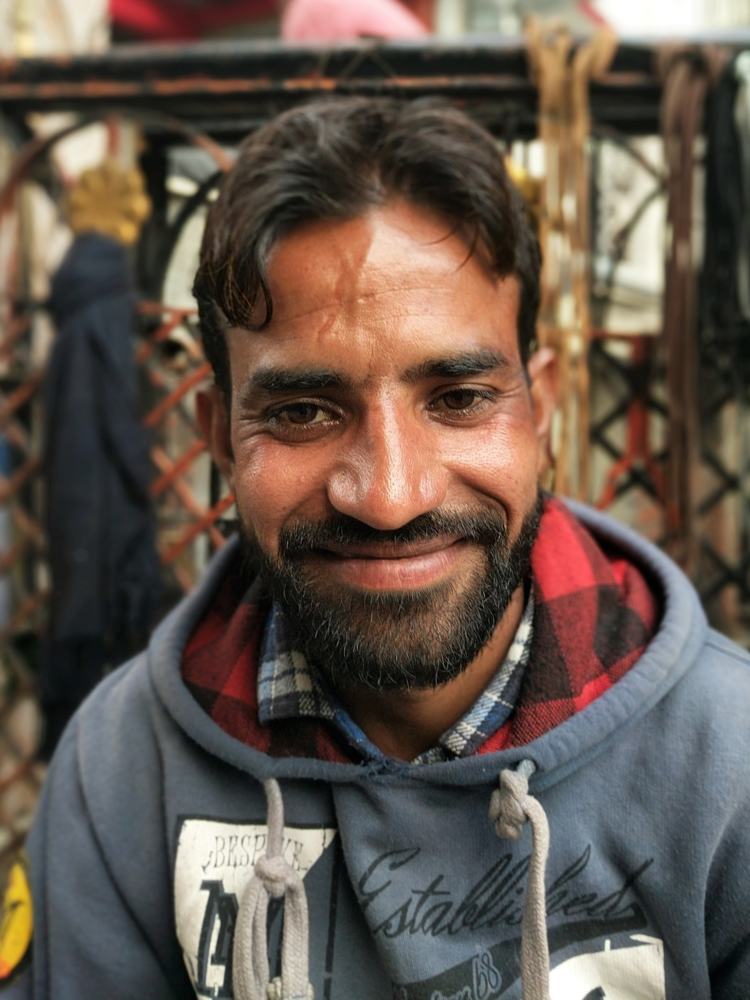
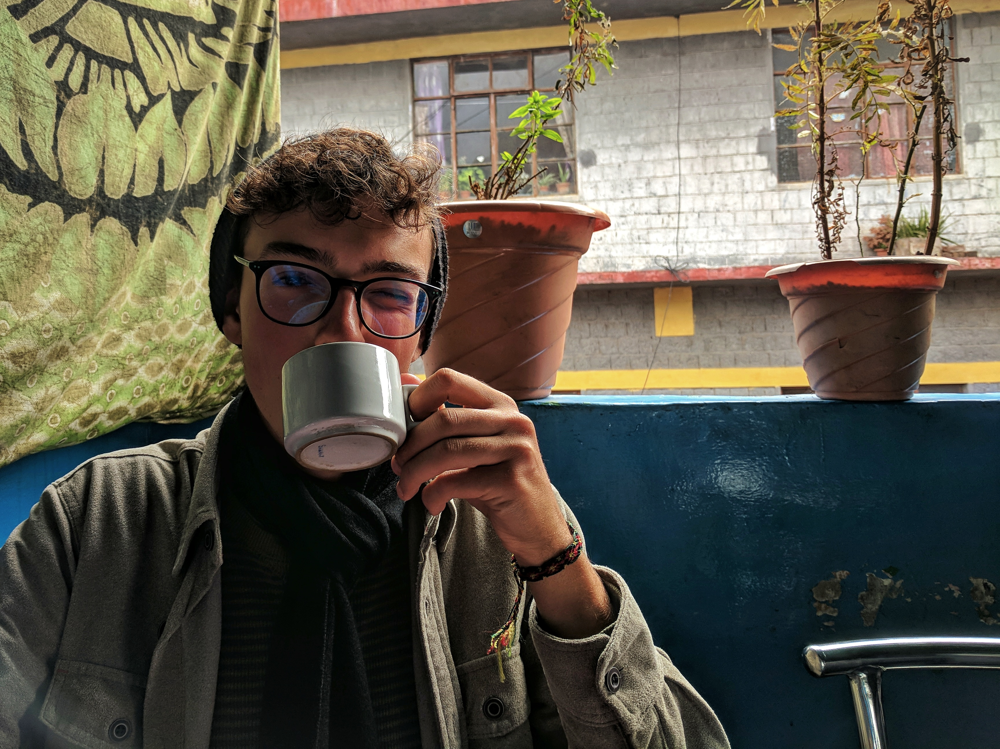
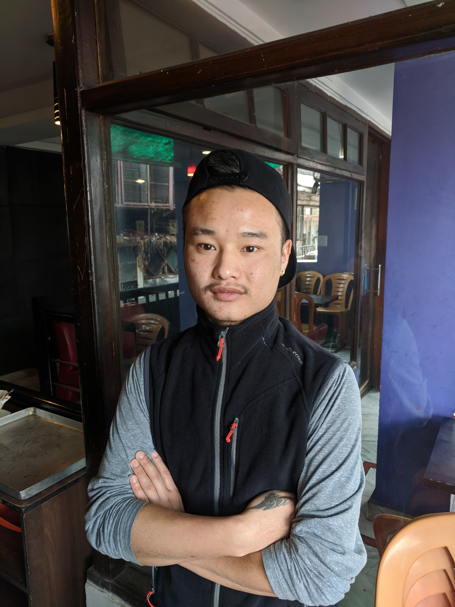

## Humans of Dharamshala
While studying in Dharamshala, India, I volunteered with Hope Gallery/Wild Yak Studios in McCloud Ganj to help with their "Humans of Dharamshala" project. The goal of the project is to explore the unique city of Dharamshala and feature the stories and portraits of those who call it home. 

### [Javid - Shopkeeper](/javid.md)

### [Vijay - Shoe Doctor](/vijay.md)

### [Riccardo - Student](/riccardo.md)

### [Tenzin Losel - Student](/tenzin_losel.md)

### [Anonymous - Carpe Diem Patron](/carpe_diem.md)

### [Champa - Teacher](/champa.md) -- Separate from the Humans of Dharamshala project, I also interviewed a Tibetan in exile named Champa, who lived a nomadic lifestyle in Tibet until he was 8 years old.
