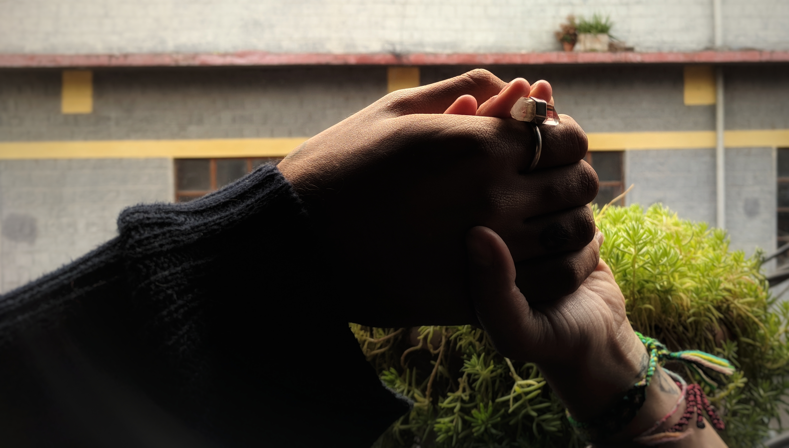

## Anonymous - Cafe Patron

“If you go to parts of Europe, people don’t know what is happening in my country. Sometimes in Kashmir there are shootings for nothing. Sometimes someone may make the wrong expression, and soldiers will shoot them. They don’t care if it is a small child, older man, younger man. . . It’s just to make violence. It’s very hard; life is getting very hard. To be honest with you, I believe only in myself, because I see with my eyes. So many people killed for nothing.  For no reason: by the soldiers, by the terrorists, it’s just a game to them. I wish that before people make a weapon, they would think: ‘Why are we using this on another human being?’ I pray for this kind of thing. There is peace nowhere. Even in America there is no peace: people are always stressed about something; there is nowhere quiet. One country has this problem, another country has that problem. If you divide these problems and look deeply, at the end they are the same kind of problems.

It is not ‘oh I won this election, this is my country.’ People need to be equal. One person is my friend, another is my enemy: for what? For example, if there is a car accident, we need to help them. We need to take their body somewhere, to get them help. In India, sometimes if someone is injured, and we take hard, but I am trying my best. If there is someone I don’t know, I try my best to help them. We are for each other to help.“

Anonymous - Cafe Patron

---
### [Back](/pages/humans_of_dharamshala.md)
