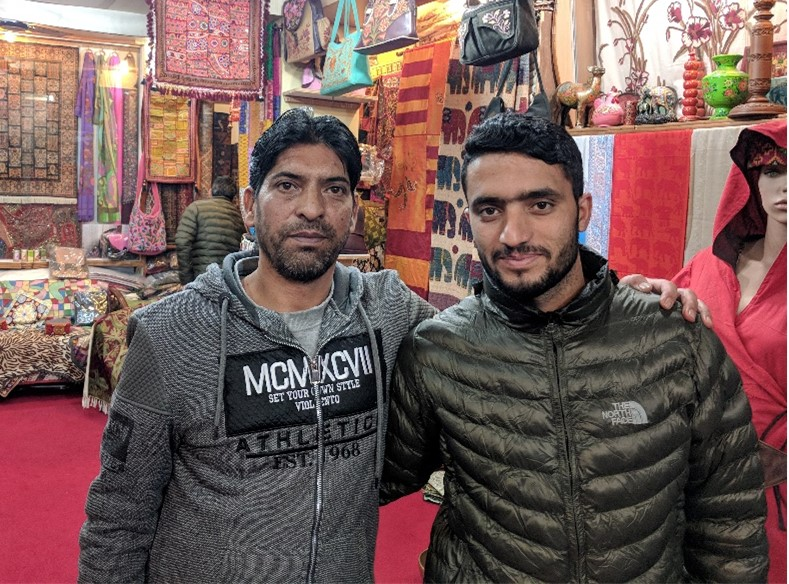

## Javid - Shopkeeper

“Hello, my name is Javid; I am from Kashmir. I’ve been in Dharamshala since 1990. There was a war in Kashmir, so we left Kashmir and came here for business. We shifted our business here because there was too much terrorism in Kashmir. Terrorists wanted us to join the groups, become terrorists, and fight for Kashmir, for the land. So, we left and came here in 1990, and started a family business since then.
It is very nice here, very peaceful. First, we went to Delhi, but Delhi is a very big city with a lot of pollution and a lot of traffic: it was not a good life. So, we found this place, Dharamshala. The local people are very nice, very beautiful.
We are Muslims, and they are Christians, Buddhists and Hindus: all the religions live together here, no problems. I can go to temple, mosque, church, no worries.
Half of Kashmir is occupied in Pakistan, and half is occupied in India: but the people are the same. They want to meet each other; they want borders to open, to meet their families, to live together, to come and go. The India Pakistan war is not helping. They can not solve the problem. Many times, they have tried to solve the problem, but it is not happening. Both sides are killing, army and terrorists. You can not be anybody’s friend. If I am a friend of an army man, the terrorists will kill me. If I am a friend of a terrorist, the army will kill me. So, we had no choice, we had to leave Kashmir."

Javid - Shopkeeper

---
### [Back](/pages/humans_of_dharamshala.md)
