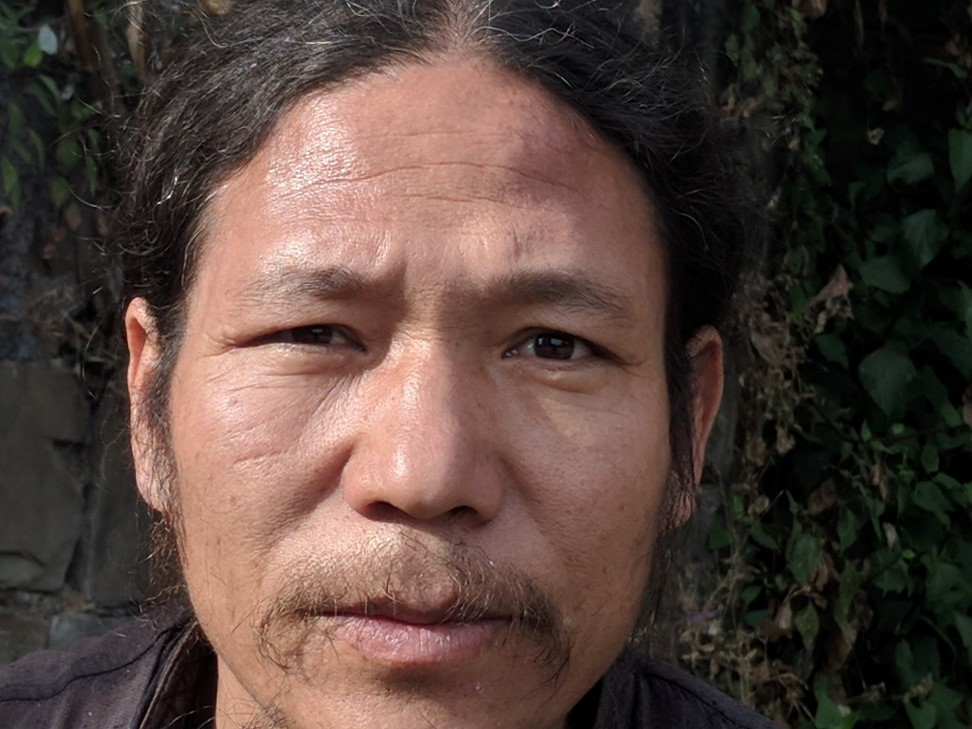
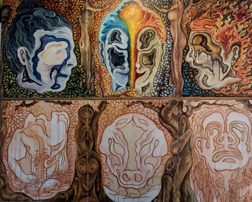
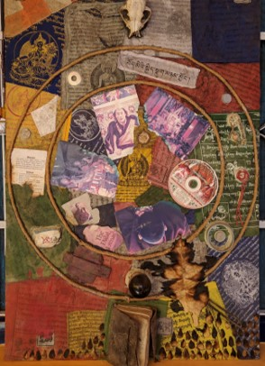

## Karma - Thangka Artist Turned Contemporary Painter

---
---

While in Dharamshala, I had the pleasure of meeting Karma Sichoe. Karma is a master of traditional Tibetan Thangka painting, with 25 years of experience. After leaving the tradition, he now creates contemporary art paintings and sculptures. My presentation about Tibetan Art can be accessed with [this link](../pdf/thangka_tibetan_art.pdf).

Below is my conversation with Karma Sichoe.

---
---

**What are your thoughts about studying and teaching thangka to preserve that aspect of Tibetan identity?**
 
“First of all, I am not much into preserving. I don’t know… the word preserving, categorizing… they are a bit too stereotyped for me. I feel like it is better to share, so there is not much of a sense of preserving identity, culture, these things. My way of sharing is not so much towards preserving, it is more about sharing. Yes of course there are people who also share with the thought of preserving. For me, to hold onto the past. . . it is something you are stuck with. You hold, and you are not able to move on. So, if you sincerely are moving ahead, you don’t need to worry about preservation. That is how I function, you know? Preserving, I don’t think much of that.”

---

**What impact has your 25 years of experience thangka painting had on your current artistic expression?**
 
“Altogether, I have a very good experience, and that is who I am in the moment. The best part of my life I partly spent on being a thangka painter. It impacted me a lot. Basically, I can sum up the person who I am now as being who I am because I am a thangka painter. It shapes my whole personality. In thangka, you must go through vigorous training. It’s move like craftsmanship training, but at the same time on more of an artists level. It’s very strict. It’s very competitive for one’s self. One needs the best of perfection, and everything. There is lots of past stigma and belief systems attached to it. Especially in the name of preserving one’s own heritage and culture. These things are attached to it.”

---

**Could you explain what you meant by stigma?**
 
“When you are in a state where we are, there is too much emphasis on preserving. Sometimes when you emphasize too much, it creates a stigma, sort of a burden. Thangka deals with the people’s faith. Dealing with the people’s faith is one of the trickiest things, because that’s how politics are shaped, in the name of belief. People kill each other: so far, these wars we have fought are mostly in the name of faith. Then, when you learn Thangka painting, you always hear if you don’t paint good, you are playing with the people’s faith, and that’s why you are a sinner. . . *pauses, then laughs*. So, when you play with the people’s faith, you are a sinner. The nature of the faith is quite sincere and pure. When you play with this, no matter how big, you are a sinner *laughs again*. This becomes a stigma, a burden. Then you go through the rigorous training of yourself. You are challenged to the limit. You are dealing with perfection. You are dealing with the execution of your work. You are dealing with the best of the best. Then sometimes it becomes too much stress on your body, and your mind. . . These reasons shape who I am at the moment.”
 

_Regarding concepts of Thangka which impact his modern style_
 
“\[The concepts of thangka are most important; they are what I keep\]. This concept deals with the human emotions. When you deal with the human emotions, that drives towards your actions, and for you to create karma. All the time in Thangka, you are trying hard to understand how the human emotion works. That concept is still behind all my contemporary work. In the end, because of the emotions that lead us to create our own karma and actions, that action becomes collective politics. The politics shape everyone, you as well. It is one path, and it affects everyone. That concept, that I dealt with for a long time, is still there.”

“The colors that I use in Thangka, and the forms that I use in Thangka. That effects a lot in translating my own perspective of contemporary…. Of contemporary life. Mainly the idea behind working is still the same as when I was a thangka artist. But now, what is not the same, is …. In thangka there are many. . . uh… there are lots of restrictions that are created by its own name, by its own way of practice. You hardly see any political thangka paintings. There are a few, but it’s not very common.”

---

**Can you describe what you mean by political thangka paintings?**
 
“Thangka is mainly painted in a religious aspect. That’s why most of the thangka that you see in people’s houses are all in a religious aspect. There is nothing much about the contemporary issues in the contemporary life we are dealing with. There is a historical painting, but it’s painted mainly because it is mixed with faith, and all these things. The religious institutions become too powerful, and then they want to narrate the history in their own terms. So, you see lots of historically based paintings in thangka format, but through the perspective of religious institutions. So, political means the thangka is based on how you feel, how you observe, how you see things. Then it is political. As long as it becomes an object itself, it creates a story. When it creates a story, it becomes political. That’s what I mean by political. There are many things in thangka when you don’t paint the contemporary feeling that you are feeling in the moment. The things you are seeing from your eyes you don’t paint. You paint what you see, but you have to come towards the main agenda, which is a religious aspect.”

---

**How does creativity manifest in Thangka?**
 
“It manifests in different ways. It’s kind of like, you have to act in a very balanced way; you are constantly influenced by the other thoughts. You are dealing with not just first person or second person, you have to deal with the third person as well. It’s not just that you paint what you feel, you paint also paint what the others feel. It’s a medium where you connect. You are one of the contributors where you create a condition to connect people, to connect things. You are part of the process of making a bridge, making communications. So, you always must listen to the second person or third person. That’s why it restricts you in your freedom of expressions.”

“\[When creativity and freedom of expression\] come together, you are fully yourself. Then, there’s no second person you need to listen to or feel. You just need to see yourself. That is most important for me to come out, because I need to see myself. I need to make that connection. That’s another reason why I don’t work thangka, because I don’t like to work on a commission basis. It took me a long time to do all the work that I took. It took me two years, three years to finish all the commissions that I had, so I can work independently. I just need to listen to myself, and see myself. So, all my paintings have originated because of that.”

---

**Do the shapes and patterns in Thangka transfer over into your contemporary style?**
 
“Yeah, I play with the forms: form and formless. Within this, I play. So yeah, there are lots of forms, lots of symbolisms. You know, the freedom about playing with the form is that you can play a lot – and formless, of course. Then you can put many layers. . . If you just stick to the form, it is too direct, and then it is not poetic enough for me to work on. There are lots of layers.

---

**Do you work with oil paint?**
 
“No. Many people think I work with oil, because I don’t mix in too much water. It’s acrylic. I don’t have a good ventilation to use oil. I need an exhaust: it is too damp during the monsoon. Just the window I have is not enough for the oil. That is why I don’t work with oils.”

---

**Could you explain the conceptual process behind each of these panels?**
    
“I got this inspiration from Tibetan Thangka format paintings. I just put my own narrative, my own perspective. You see here the six panels. In thangka, this is what we call the wheel of life. Inside the wheel of life, there are six lives: god, demigod, human, hungry ghost, animal, and hell. Then I try to bring all these ideas and concepts into my own self: I take it very personal. Since I take it very personal, I make it into a portrait. Each is my own self portrait *laughs*. I try to paint what I understand as a life of god, human, demigod, hungry ghost, animal, and hell within my own personality. How do I identify all these characters of life in my own state of life? So, I try to make this very personal, and make it into a self-portrait. It is not a portrait that you see, it is a portrait of what is inside you. For example, in a human I put all these circles: all the energy coming to one direction. In a human life, you have a choice. You see all the things in front of you: the good things, the bad things. It represents all this energy, and the energy represents all these choices. All the energy coming together towards one common goal represents that you have a lot of choice to decide what is right for you or not. That makes the human life special. That is how I play with the fire and the waves together. I quite like the water and fire. It is also a political symbol for me, because the elements and the modern politics that we are dealing with: you are constantly challenged by the environment that you are staying in. The water and fire elements can destroy you, or enrich you. It is the energy of transformation, an energy of clearing and purifying things. It’s also a very politically symbolic element. Now, we are finally realizing how much we are connecting with the environment. This is how we come to talk about global warming, because we are playing too much with the energy.”

“With god and demigod, I didn’t translate the way normally people think. Each element represents a way of thinking. Here you see the hungry ghost crying. You see there is lots of Thangka influence. I explain in a surreal abstract. That is how I feel about my painting. You see there are lots of forms taking their own shapes, all connected.”

---

**When did you start this project?**
 
“Almost 8 months now. After this there will be 12 panels.”

**Each representing one of the links?**
 
“Yeah, the interdependency links.”

*regarding samsara trash piece*
    
“I work with waste material. I collect all this from the circumambulation place around his holiness’ palace. So, I clean the place, then separate the garbage, then make this. *laughs* It is the Tibetan samsara, the wheel of life. This is what I call, Holy Garbage *laughs*.”

“I am always concerned about where I am staying. I am very connected to the elements that I am living with. I am always conscious about the energy that we consume on the daily basis of our life. Self-disciplining and all these things is always in me. When I think about my own community, upbringing, and culture, I see a lot of things that I don’t want to see around. We have to be really careful what we are consuming. All these prayer flags have a good intention, good motivation: to bring some kind of good energy around, good atmosphere. But they are made out of polyester, the plastic! It doesn’t disintegrate, it hangs on the tree, and it doesn’t allow the tree to grow. When the prayer flags threads are broken, it doesn’t allow the plant to grow. This is why it is still a filthy dirty thing, I did not wash. If I wash, the story is gone. In the name of religion, we consumed the energy to make the prayer flags, and it kills the very elements that you stand on, and that you stand for. It is very contradicting for me, because you pray for the goodwill of everybody, but then in the same process, you are killing. I want to bring that out to the people: ‘look, that’s how we are.’ It’s a plastic civilization we are living in. All these photos that I got on here: they are holy pictures for all the Tibetans. But then you come to the holy places, and you might not have time to burn properly: you leave it half burnt.”

---

**Why were they burned?**
 
“Because it is holy. Anything holy you shouldn’t just dump, you burn them. So, I made this in the international art workshop, which happened here, organized by one art NGO in Delhi, which is called Khoj, and they are partnered with DIFF (Dharamshala International Film Festival). They organized international artist workshops. When I made this, it was the first one, 5 years ago. I asked all the artists there how they cleaned the place. They helped me to clean the place. All-together, I gathered four sets of garbage, of junk. I scatter them around, then choose the elements that I need.”

---

**How does the Buddhist concept of no self take form when Thangka painting?**
 
“It is not right to say we don’t have freedom of expression, we have it. The thing is, first you have to know the rules of the game. Once you know the rules, then you have space where you can express your freedoms. Without knowing this, you don’t have a space to express yourself. Thangka for many people, it is a selfless act, that is why they say you don’t have freedom of expression. Actually, it has to do a lot with yourself. How do you put your own narrative about me, about we, about us? Without understanding what you hear about selflessness, you cannot do any work. In one way, generally thangka painters say there is no self-oriented subject. But you have to deal with it. Since I try to paint what my clients want, automatically you are pushed more towards a selfless act. Then when you move more towards an open subject matter for your work, sometimes it can be difficult, because you don’t know how to personalize everything. In Thangka you are not dealing with your physical observation, like watching things, looking around. This is difficult.”

Karma Sichoe – Traditional Thangka Artist Turned Contemporary Painter

---
### [Back](/pages/humans_of_dharamshala)
