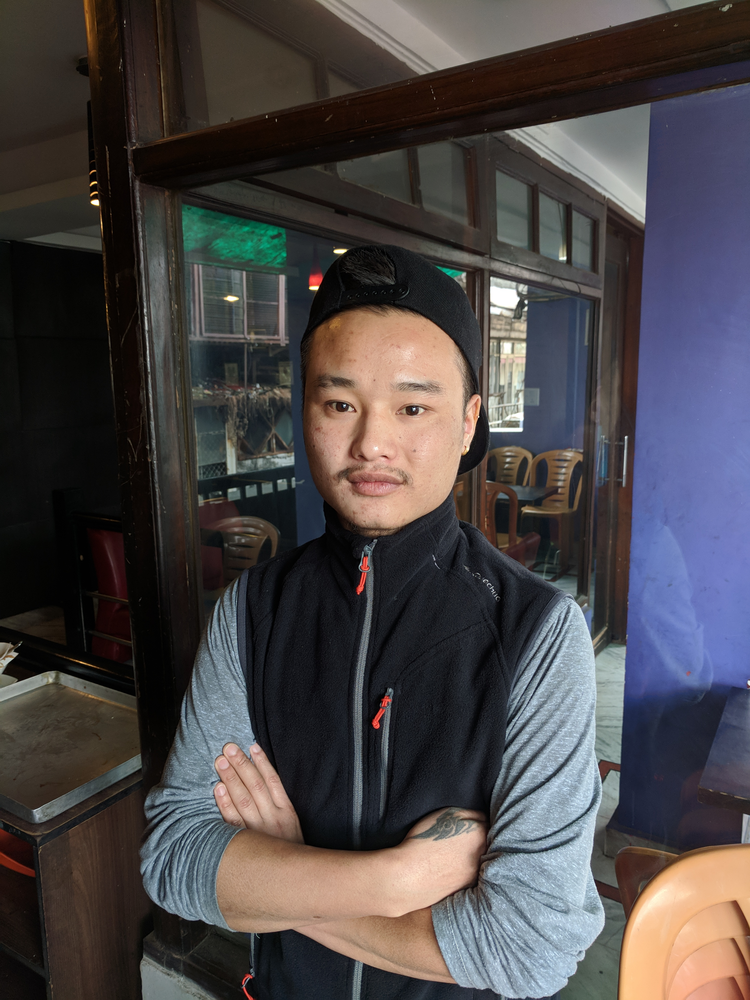

## Tenzin Losel - English Student

“I was born in Arunachal Pradesh, it is a small state of India. It’s in the Himalaya, near the Chinese border. I was born in Tawang. My tribe name is called Monpa, and it’s similar to Tibetan. Everything is similar. We migrated from Tibet before. That is why we have the same script, only our language is different. Tawang is very far from here – by train, it will take 3 days. It is at a very high altitude: 15,000ft. There are lots of lakes, historical places, and monasteries. Tawang monastery is the second largest monastery in the world \[behind the Potala Palace in Lhasa, Tibet\].

My home is totally pollution free, and everything is very cheap. We do not pay for water. If you visit, the people are very helpful, unlike cities. I like Himalayan area people, they are very helpful. City people can be very dominating.

I came to Dharamshala to learn English. I’ve been here 5 months, and I will go back to Arunachal Pradesh in February. It is very close to the border, only 40km. The road conditions are very bad. Only vehicles can travel there.” 

Tenzin Losel – English Student

---
### [Back](/pages/humans_of_dharamshala)
